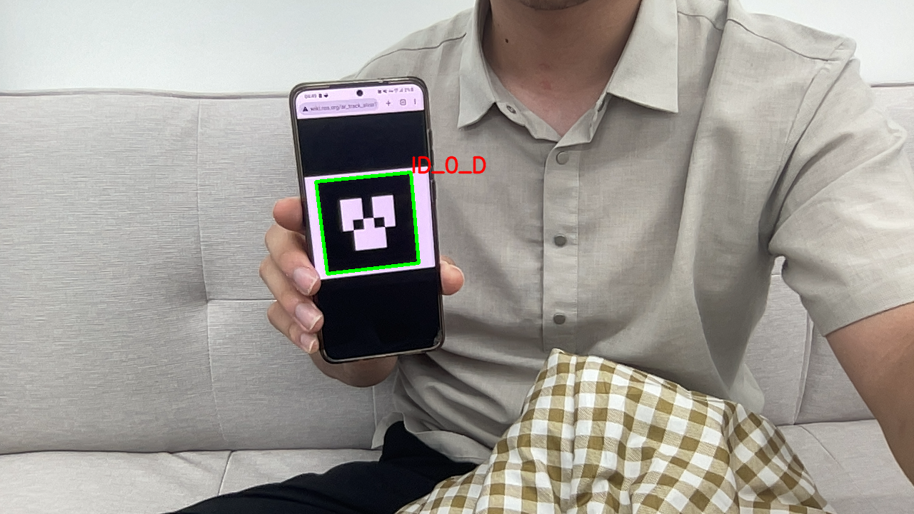

# OpenCV Based Marker Detection

This project detects Aruco marker and arbitrary marker (in this example, Alvar marker) using OpenCV 4.8, with minimal dependencies.

# Requirements

- Python 3.8
- OpenCV 4.8
- Numpy

# Usage

- `example_aruco.py`: This example detects Aruco marker.
- `example_manual.py`: This example detects arbitrary marker (in this example, Alvar marker).

# Results

# References

- https://docs.opencv.org/4.x/de/d67/group__objdetect__aruco.html
- https://docs.opencv.org/4.x/d5/dae/tutorial_aruco_detection.html
